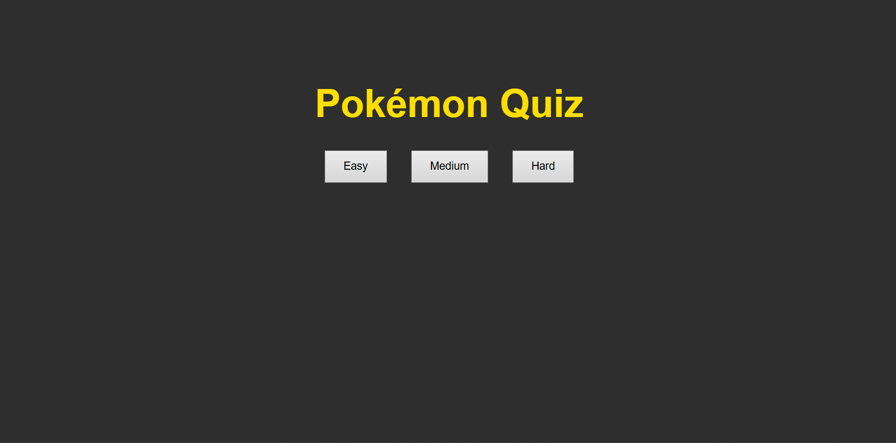
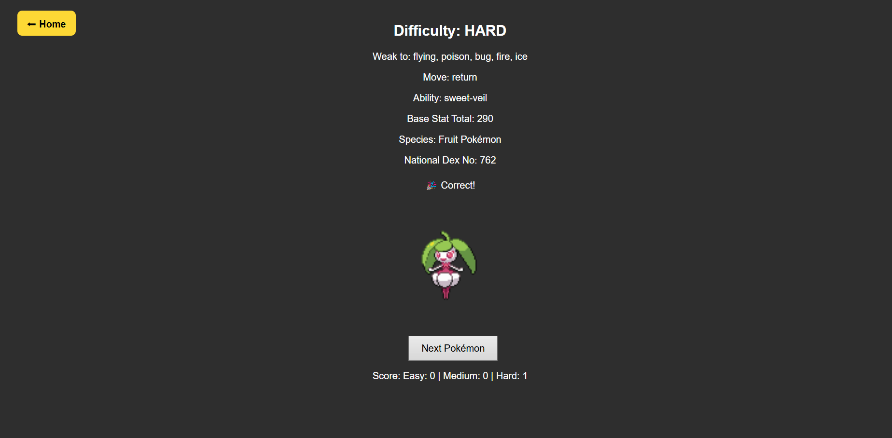

# 🎮 Pokémon Quiz Game

A full-stack Pokémon quiz website built with **React** (frontend), **Node.js/Express** (backend), and the **PokéAPI**.  
Players can choose between Easy, Medium, and Hard difficulty levels, guess Pokémon based on clues, and track their scores.

---

## ✨ Features

- 🎯 **Three difficulty levels** (Easy, Medium, Hard) with unique clues:
  - **Easy** → Typing, Generation, Evolution stage, Pokedex entry, First/Last letters, Silhouette.
  - **Medium** → Typing, Evolution count, Generation, Species, First/Last letters, Silhouette.
  - **Hard** → Type weaknesses, Random move, Ability, Base Stat Total, First location, National Dex number.
- 🖼️ **Silhouette guessing** (images pulled from PokéAPI sprites).
- ⌨️ **Autocomplete guessing box** with suggestions as you type.
- 🔄 **Unique Pokémon selection** (no repeats until all are used in that difficulty).
- 🏆 **Separate score tracking** for each difficulty.
- 📜 **Clue progression** → up to 6 clues revealed if you guess wrong.
- 🔙 **Home button** to return to the landing page.
- ✅ **Error-safe backend logic** (handles missing data gracefully).
- 🎨 Clean and responsive UI.

---

## 🛠️ Tech Stack

- **Frontend:** React, CSS
- **Backend:** Node.js, Express
- **API:** [PokéAPI](https://pokeapi.co/)
- **Other:** React Router, Fetch API

---

## 📂 Folder Structure

```
PokeQuiz/
│
├── backend/
│   ├── index.js           # Express server + quiz logic
│   ├── package.json
│
├── frontend/
│   ├── public/
│   ├── src/
│   │   ├── App.js         # Main React component
│   │   ├── HomeButton.js  # Reusable Home button
│   │   ├── App.css        # Styling
│   │   └── index.js
│   ├── package.json
│
├── README.md
```

---

## 🚀 Getting Started

### 1. Clone the repo
```bash
git clone https://github.com/your-username/pokequiz.git
cd pokequiz
```

### 2. Setup Backend
```bash
cd backend
npm install
npm start
```
Runs on **http://localhost:5000**

### 3. Setup Frontend
```bash
cd frontend
npm install
npm start
```
Runs on **http://localhost:3000**

---

## 📸 Screenshots

### Landing Page


### Gameplay


---

## 🔮 Future Improvements
- Add multiplayer/leaderboards.
- Timer-based scoring system.
- Mobile-first UI polish.
- Offline mode with local Pokémon dataset.

---

## 🤝 Contributing

Pull requests are welcome!  
1. Fork the project  
2. Create a feature branch (`git checkout -b feature-name`)  
3. Commit changes (`git commit -m "Added feature"`)  
4. Push to branch (`git push origin feature-name`)  
5. Open a Pull Request  

---

## 📜 License

This project is licensed under the MIT License.  
Pokémon and Pokémon character names are trademarks of Nintendo/Game Freak.
